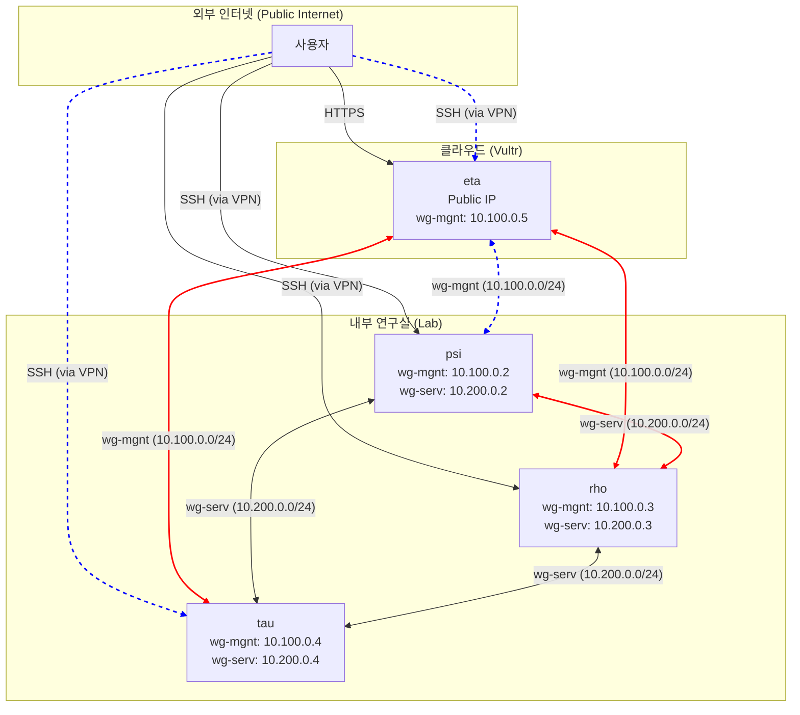

# 네트워크 토폴로지

SBEE Lab 인프라의 서버들은 물리적으로 분산된 위치에 있지만, WireGuard VPN을 통해 하나의 논리적인 내부 네트워크를 형성합니다. 이는 안전하고 일관된 서버 간 통신을 보장합니다.

## 내부 네트워크 (WireGuard)

두 개의 주요 WireGuard 터널 인터페이스가 사용됩니다.

1.  **`wg-mgnt` (Management Network)**
    -   **목적**: 서버 관리 및 운영을 위한 네트워크입니다. SSH 접속, 모니터링 데이터 수집 등 관리 트래픽 전용으로 사용됩니다.
    -   **서브넷**: `10.100.0.0/24`

2.  **`wg-serv` (Service Network)**
    -   **목적**: 서버 간 내부 서비스 통신을 위한 네트워크입니다. 예를 들어, `psi` 서버가 `rho` 서버의 Nix 바이너리 캐시를 사용하거나, 내부 서비스 간 API를 호출할 때 이 네트워크를 사용합니다.
    -   **서브넷**: `10.200.0.0/24`

## 외부 네트워크 및 접근

-   **`eta` 서버**는 유일하게 공인 IP 주소를 가지고 외부 인터넷과 직접 연결됩니다. 외부에서 접근 가능한 웹 서비스 등은 `eta` 서버를 통해 호스팅됩니다.
-   `eta`는 다른 내부 서버들과의 WireGuard 터널을 통해 연결되어, 외부 요청을 내부 서비스로 안전하게 전달하는 게이트웨이 역할도 수행할 수 있습니다.
-   일반적인 서버 접속은 관리용 VPN(`wg-mgnt`)을 통해 이루어지므로, 각 서버의 SSH 포트 등은 외부에 노출되지 않습니다.

## 네트워크 구조 다이어그램

