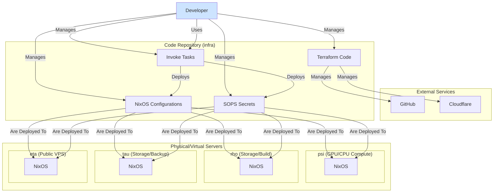

# 시스템 아키텍처 개요

이 문서는 SBEE Lab 인프라의 전체적인 구조와 이를 구성하는 핵심 기술 요소들에 대해 설명합니다.

## 핵심 철학 및 기술

본 인프라는 **Infrastructure as Code (IaC)** 철학을 기반으로, 모든 시스템 구성을 코드로 관리하여 **선언적(Declarative)**이고 **재현 가능한(Reproducible)** 환경을 지향합니다.

-   **NixOS & Nix Flakes**: 운영체제(NixOS)를 포함한 모든 시스템 구성을 선언적으로 기술하고, Flakes를 통해 프로젝트의 의존성을 안정적으로 관리하는 핵심 기반입니다.

-   **`flake-parts`**: 복잡해질 수 있는 `flake.nix` 파일을 모듈화하여 구조적으로 관리할 수 있도록 돕는 도구입니다.

-   **`sops-nix`**: 시스템의 모든 비밀 정보(API 키, 비밀번호, 인증서 등)를 안전하게 암호화하여 Git 저장소에서 관리할 수 있게 해주는 도구입니다.

-   **`disko`**: 디스크 파티션, 포맷, 마운트 설정을 선언적으로 관리할 수 있게 해주는 NixOS 모듈입니다.

-   **`invoke`**: 배포, 설치, 인증서 생성 등 반복적인 관리 작업을 자동화하기 위한 Python 기반의 태스크 러너입니다.

-   **Terraform**: Cloudflare(DNS), GitHub(저장소 규칙, 사용자) 등 외부 서비스의 리소스를 코드로 관리하기 위해 사용됩니다.

## 서버 역할

인프라는 명확한 역할을 가진 여러 서버로 구성됩니다.

-   **`psi`**: GPU 및 고성능 CPU를 탑재한 주력 연구 연산 서버입니다.
-   **`rho`**: 대용량 스토리지를 갖춘 서버로, 연산 작업 및 Nix 빌드 서버의 역할을 겸합니다.
-.  **`tau`**: `rho`와 유사한 스토리지 서버로, 주로 데이터 백업 및 보조 연산에 사용됩니다.
-   **`eta`**: 외부 클라우드에 위치한 가상 사설 서버(VPS)로, 공개 웹 서비스 및 외부와의 접점 역할을 합니다.

## 전체 구조 다이어그램

아래 다이어그램은 위 구성 요소들이 어떻게 상호작용하는지를 보여줍니다.

