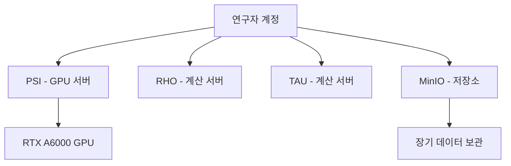
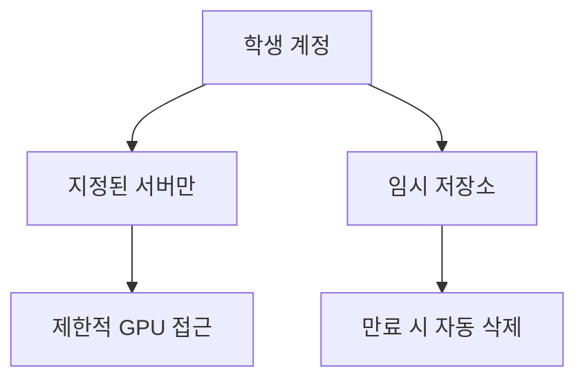
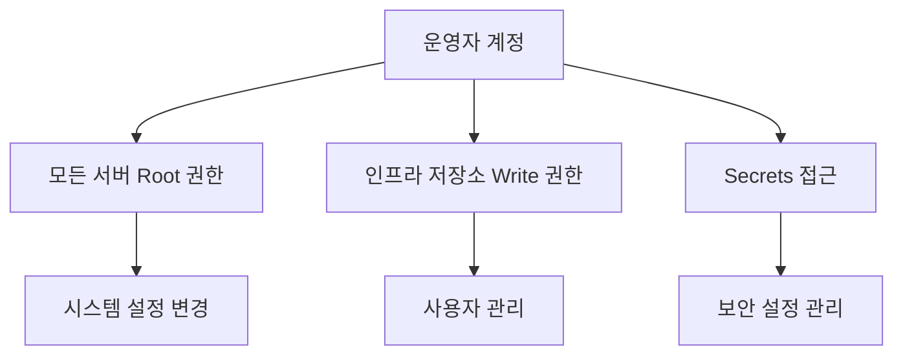

# 접근 권한 요청 (Requesting Access)

SBEE Lab 인프라에 접근하려면 먼저 사용자 계정을 요청해야 합니다. 계정 유형에 따라 요청 절차가 다르므로, 본인에게 해당하는 섹션을 참고하세요.

## 계정 유형 이해하기

SBEE Lab은 세 가지 계정 유형을 제공합니다:

### 연구자 (Researcher)

연구자 계정은 연구 프로젝트를 수행하는 박사후연구원, 공동연구자, 장기 협력자를 위한 계정입니다.

**권한**:
-   모든 계산 서버(PSI, RHO, TAU)에 무제한 접근
-   GPU 리소스 사용 (PSI 서버)
-   장기 데이터 저장소(MinIO) 접근
-   계정 만료 없음 (연구실 소속 기간 동안 유지)

**대상**:
-   박사후연구원
-   공동연구자 및 협력 연구자
-   장기 프로젝트 참여자

### 학생 (Student)

학생 계정은 인턴십, 단기 프로젝트, 수업 참여 학생을 위한 임시 계정입니다.

**권한**:
-   지정된 계산 서버 접근 (보통 RHO 또는 TAU)
-   제한적인 GPU 리소스 접근
-   임시 데이터 저장소 사용
-   계정 만료일 설정 (보통 3-6개월)

**대상**:
-   인턴십 참여 학생
-   수업 수강생
-   단기 프로젝트 참여자

**만료 정책**:
-   학생 계정은 만료일이 지나면 자동으로 비활성화됩니다
-   만료일 2주 전에 이메일 알림이 발송됩니다
-   연장이 필요한 경우 만료 전에 요청해야 합니다

### 운영자 (Operator)

운영자 계정은 인프라 관리 및 유지보수를 담당하는 시스템 관리자를 위한 계정입니다.

**권한**:
-   모든 서버에 대한 root 권한
-   인프라 설정 변경 권한
-   사용자 계정 관리 권한
-   시크릿(secrets) 및 보안 설정 접근

**대상**:
-   시스템 관리자
-   인프라 개발자
-   DevOps 엔지니어

!!! note "운영자 계정 요청"
    운영자 계정은 PI(Principal Investigator) 또는 현재 운영자의 직접 승인이 필요합니다. 일반적인 연구 목적으로는 연구자 또는 학생 계정을 요청하세요.

## 계정 요청 절차

### 1단계: 필수 요구사항 확인

계정을 요청하기 전에 다음 사항을 준비하세요:

- [ ] [필수 요구사항](prerequisites.md)의 모든 항목 완료
- [ ] GitHub 계정 생성
- [ ] SSH 공개키 생성 (`~/.ssh/id_ed25519.pub` 또는 `~/.ssh/id_rsa.pub`)
- [ ] 소속 기관 및 연구 목적 명확히 파악

### 2단계: GitHub 이슈 생성

계정 요청은 GitHub 이슈를 통해 이루어집니다.

1. **저장소 이동**: [sbee-lab/infra](https://github.com/sbee-lab/infra) 저장소로 이동합니다.

2. **새 이슈 생성**:
    - "Issues" 탭 클릭
    - "New issue" 버튼 클릭
    - "Account Request" 템플릿 선택 (템플릿이 없는 경우 아래 양식 사용)

3. **이슈 양식 작성**:

    ```markdown
    ## 계정 요청 (Account Request)

    ### 기본 정보 (Basic Information)
    - **이름 (Full Name)**:
    - **이메일 (Email)**:
    - **GitHub Username**:
    - **소속 (Affiliation)**:
    - **계정 유형 (Account Type)**: [Researcher / Student / Operator]

    ### 학생 계정 추가 정보 (For Student Accounts)
    - **지도교수/PI (Supervisor/PI)**:
    - **프로젝트 기간 (Project Duration)**: YYYY-MM-DD ~ YYYY-MM-DD
    - **목적 (Purpose)**: [Internship / Coursework / Research Project]

    ### SSH 공개키 (SSH Public Key)
    ```
    ssh-ed25519 AAAAC3NzaC1... your_email@example.com
    ```

    ### 연구 목적 (Research Purpose)
    간단히 서버 사용 목적을 설명해주세요 (2-3문장).

    ### 추가 사항 (Additional Notes)
    기타 요청사항이나 특이사항을 기재해주세요.
    ```

4. **이슈 제출**:
    - 제목: `[Account Request] 귀하의 이름`
    - Label: `account-request` 추가
    - Submit issue 클릭

!!! tip "SSH 공개키 복사하기"
    터미널에서 다음 명령어로 공개키를 클립보드에 복사할 수 있습니다:

    ```bash
    # macOS
    pbcopy < ~/.ssh/id_ed25519.pub

    # Linux (xclip 설치 필요)
    xclip -sel clip < ~/.ssh/id_ed25519.pub

    # 또는 직접 출력하여 복사
    cat ~/.ssh/id_ed25519.pub
    ```

### 3단계: 승인 대기

계정 요청 이슈를 제출하면:

1. **검토 시작**: 운영자가 24-48시간 내에 요청을 검토합니다.

2. **추가 정보 요청**: 필요시 이슈 댓글로 추가 정보를 요청할 수 있습니다.

3. **승인 또는 거부**:
    - **승인**: 이슈에 "approved" 라벨이 추가되고, 계정 생성 작업이 시작됩니다
    - **거부**: 거부 사유가 댓글로 안내됩니다

4. **계정 생성 알림**: 계정이 생성되면 이슈 댓글과 이메일로 알림을 받습니다.

!!! warning "이슈 공개 정보"
    GitHub 이슈는 공개적으로 접근 가능합니다. 민감한 개인 정보(전화번호, 주민등록번호 등)는 절대 기재하지 마세요.

### 4단계: 계정 활성화 확인

계정이 생성되었다는 알림을 받으면:

1. **SSH 접속 테스트**:
    ```bash
    ssh your_username@psi.sbee.lab
    ```

2. **WireGuard VPN 설정** (외부 접속용):
    - 운영자로부터 WireGuard 설정 파일을 받습니다
    - [최초 설정 가이드](first-time-setup.md)를 참고하여 VPN을 구성합니다

3. **환경 확인**:
    ```bash
    # 홈 디렉토리 확인
    pwd

    # 사용 가능한 리소스 확인
    df -h ~

    # 그룹 멤버십 확인
    groups
    ```

## 계정 유형별 접근 범위

### 연구자 계정



### 학생 계정



### 운영자 계정



## 자주 묻는 질문 (FAQ)

### Q: 계정 요청이 얼마나 걸리나요?

**A**: 일반적으로 영업일 기준 1-2일 내에 처리됩니다. 긴급한 경우 PI에게 직접 연락하여 우선 처리를 요청할 수 있습니다.

### Q: 학생 계정을 연구자 계정으로 전환할 수 있나요?

**A**: 네, 연구실에 정식으로 합류하거나 장기 프로젝트가 시작되면 계정 유형 변경을 요청할 수 있습니다. 새로운 이슈를 생성하거나 기존 이슈에 댓글로 요청하세요.

### Q: SSH 키를 나중에 추가하거나 변경할 수 있나요?

**A**: 네, Pull Request를 통해 `modules/users/` 디렉토리의 본인 사용자 정의를 업데이트할 수 있습니다. 자세한 내용은 [기여 방법](../developer-guides/contributing.md)을 참고하세요.

### Q: 여러 SSH 키를 등록할 수 있나요?

**A**: 네, 여러 기기(노트북, 데스크톱 등)에서 접속하는 경우 여러 공개키를 등록할 수 있습니다.

### Q: 계정이 거부되면 어떻게 하나요?

**A**: 거부 사유를 확인하고 문제를 해결한 후 다시 요청할 수 있습니다. 불분명한 경우 PI 또는 운영자에게 직접 문의하세요.

## 다음 단계

계정 생성이 완료되면 [최초 설정](first-time-setup.md) 가이드를 따라 환경을 구성하세요.

## 도움이 필요하신가요?

계정 요청 과정에서 문제가 발생하면:

-   **GitHub 이슈**: 계정 요청 이슈에 댓글로 문의
-   **이메일**: PI 또는 운영자에게 직접 연락
-   **Slack/Discord**: 연구실 커뮤니케이션 채널 활용 (초대받은 경우)
