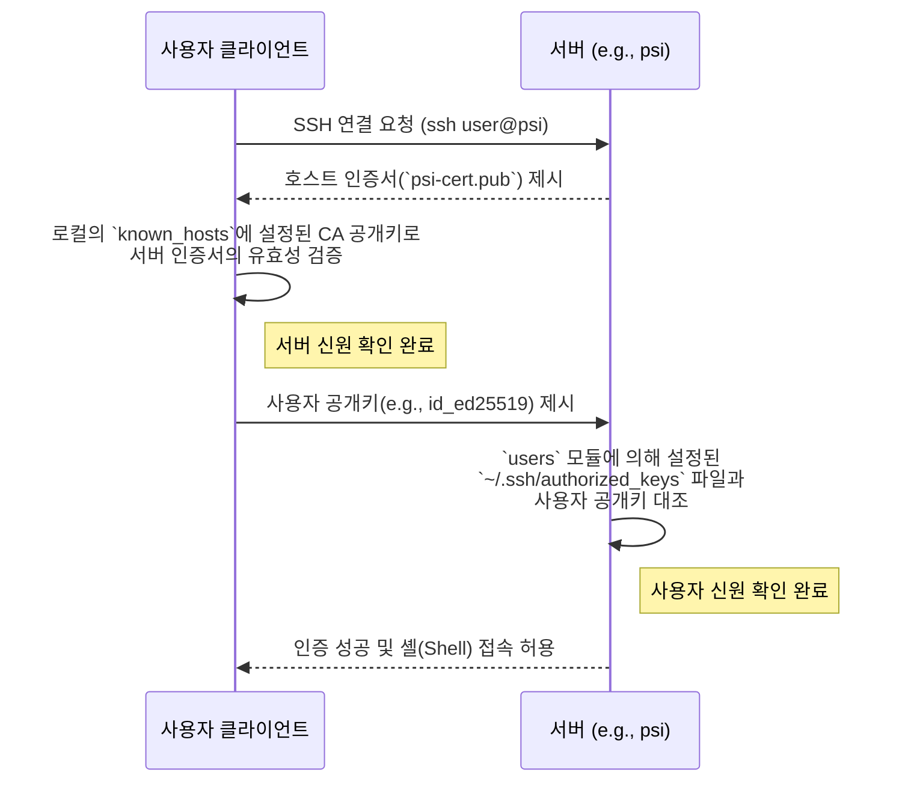

# 모듈 레퍼런스: `sshd`

## 개요

`sshd` 모듈은 인프라 내 모든 서버의 OpenSSH 데몬(`sshd`) 설정을 담당합니다. 이 모듈의 핵심 목표는 비밀번호 인증을 비활성화하고, SSH 인증서(Certificate)를 활용하여 다음과 같은 두 가지 주요 보안 기능을 강화하는 것입니다.

1.  **호스트 인증 (Host Authentication)**: 사용자가 접속하는 서버가 위조되지 않은 신뢰할 수 있는 서버임을 보장합니다.
2.  **사용자 인증 (User Authentication)**: 등록된 사용자만이 공개키(Public Key)를 통해 서버에 접근할 수 있도록 합니다.

모든 SSH 관련 설정은 `/modules/sshd/` 디렉토리 내에서 관리됩니다.

### 파일 구조

```
modules/sshd/
├── ca-keys.yaml      # SSH CA의 개인키 (sops로 암호화)
├── certs/            # 각 호스트의 서명된 인증서 (public)
│   ├── eta-cert.pub
│   ├── psi-cert.pub
│   └── ...
└── default.nix       # sshd 서비스의 주 설정 파일
```

---

## 핵심 로직 및 파일 설명

### `default.nix`

-   **소스 코드**: [`modules/sshd/default.nix`](https://github.com/sbee-lab/infra/blob/main/modules/sshd/default.nix)

이 파일은 `services.openssh` 옵션을 통해 `sshd`의 핵심 동작을 정의합니다.

#### 주요 설정

-   `PasswordAuthentication = false;`
    -   비밀번호를 이용한 모든 형태의 로그인을 비활성화하여 무차별 대입 공격(Brute-force attack)의 위험을 원천적으로 차단합니다.

-   `PermitRootLogin = "prohibit-password";`
    -   `root` 계정의 로그인을 허용하되, 오직 SSH 키를 통해서만 가능하도록 제한합니다.

-   `HostCertificate = "/etc/ssh/ssh_host_ed25519_key-cert.pub";`
    -   서버가 클라이언트에게 자신의 신원을 증명하기 위해 제시할 **호스트 인증서**의 위치를 지정합니다. 이 인증서는 내부 CA에 의해 서명되었습니다.

-   `TrustedUserCAKeys = "/etc/ssh/ssh_ca.pub";`
    -   이 옵션은 **사용자 인증서**를 신뢰하는 CA의 공개키를 지정하는 데 사용됩니다. (현재 우리 인프라는 사용자 인증에 인증서 방식이 아닌, 개별 공개키를 등록하는 `authorized_keys` 방식을 주로 사용합니다. 하지만 이 설정은 향후 인증서 기반 사용자 인증으로 확장할 수 있는 기반이 됩니다.)

### 호스트 인증서 메커니즘

우리 인프라는 중앙의 SSH 인증 기관(Certificate Authority, CA)을 운영하여 각 서버의 신원을 보증합니다.

1.  **`ca-keys.yaml`**: 이 `sops` 암호화 파일에는 호스트 인증서를 발급(서명)하는 데 사용되는 CA의 개인키가 안전하게 저장되어 있습니다.

2.  **`certs/` 디렉토리**: 각 서버(`psi`, `rho` 등)는 자신의 고유한 공개키를 CA에 제출하여 서명을 받습니다. 이렇게 서명된 결과물이 바로 호스트 인증서이며, 이 `certs/` 디렉토리에 저장되어 배포 시 각 서버의 `/etc/ssh/` 경로로 전달됩니다.

이 메커니즘 덕분에, 운영자는 처음 서버에 접속할 때 "Are you sure you want to continue connecting (yes/no)?"와 같은 신뢰성 확인 질문을 받지 않게 되며, 중간자 공격(Man-in-the-middle attack)을 방지할 수 있습니다.

### 관련 `invoke` 태스크

-   `inv generate-ssh-cert --host <hostname>`
    -   새로운 서버를 인프라에 추가할 때 사용하는 명령어입니다.
    -   이 명령은 신규 호스트의 키를 생성하고, `ca-keys.yaml`에 저장된 CA 개인키를 사용하여 해당 키에 서명한 후, `certs/` 디렉토리에 새로운 호스트 인증서를 생성합니다.

---

## 인증 흐름

사용자가 서버에 접속할 때의 전체적인 인증 흐름은 다음과 같습니다.



이처럼 호스트 인증은 CA 기반의 인증서로, 사용자 인증은 개별 공개키 기반으로 이루어지는 이중 보안 구조를 가집니다.

## 관련 가이드

-   [사용자 온보딩 가이드](../user-guides/getting-started.md): 사용자가 자신의 SSH 공개키를 등록하는 절차를 안내합니다.
-   [모듈 레퍼런스: users](./users.md): 사용자 계정의 `authorized_keys`가 어떻게 설정되는지 상세히 설명합니다.
