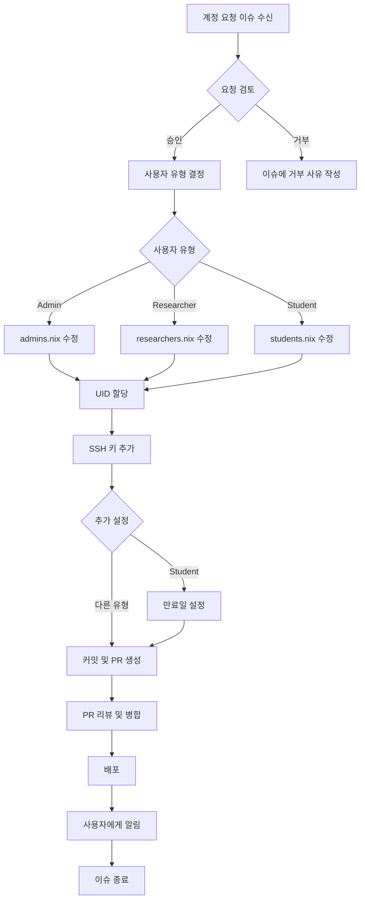

# 사용자 추가하기 (Adding Users)

이 가이드는 새로운 사용자 계정을 추가하고 적절한 권한을 설정하는 전체 과정을 설명합니다.

## 사용자 추가 워크플로우



## 사전 준비

### 계정 요청 이슈 확인

GitHub 이슈에서 다음 정보를 수집:

- [ ] 전체 이름
- [ ] 이메일 주소
- [ ] GitHub 사용자 이름
- [ ] 소속 기관
- [ ] 계정 유형 (Admin/Researcher/Student)
- [ ] SSH 공개키
- [ ] 연구 목적 또는 프로젝트 설명
- [ ] (학생) 지도교수 및 프로젝트 기간

### 요청 검토 기준

**승인 조건**:
-   연구실 소속 또는 공식 협력자
-   명확한 사용 목적
-   지도교수/PI 승인 (학생)
-   유효한 SSH 공개키 제공

**거부 사유**:
-   불명확한 소속 또는 목적
-   지도교수 미승인 (학생)
-   잘못된 SSH 키 형식
-   보안 정책 위반

## 1단계: 저장소 준비

```bash
# 저장소 클론 (최초 1회)
git clone git@github.com:sbee-lab/infra.git
cd infra

# 또는 기존 저장소 업데이트
cd infra
git checkout main
git pull origin main

# 새 브랜치 생성
git checkout -b add-user-username
```

## 2단계: 사용자 정의 추가

### 관리자 (Admin) 추가

`modules/users/admins.nix` 편집:

```nix
{
  config,
  lib,
  ...
}: let
  inherit (lib) mapAttrs;
  mkUser = import ./mkUser.nix {inherit config lib;};
in {
  users.users = mapAttrs mkUser {
    # 기존 사용자들...

    # 새 사용자 추가
    new_admin = {
      uid = 2005;  # 고유한 UID (다음 available UID)
      fullName = "New Admin";
      email = "admin@example.com";
      keys = [
        "ssh-ed25519 AAAAC3NzaC1lZDI1NTE5AAAAI... admin@example.com"
      ];
      extraUserOptions = {
        isNormalUser = true;
        extraGroups = [ "wheel" "networkmanager" ];  # sudo 권한
      };
    };
  };
}
```

### 연구자 (Researcher) 추가

`modules/users/researchers.nix` 편집:

```nix
{
  config,
  lib,
  ...
}: let
  inherit (lib) mapAttrs;
  mkUser = import ./mkUser.nix {inherit config lib;};
in {
  users.users = mapAttrs mkUser {
    # 기존 사용자들...

    # 새 연구자 추가
    new_researcher = {
      uid = 3010;  # 고유한 UID
      fullName = "New Researcher";
      email = "researcher@university.edu";
      keys = [
        "ssh-ed25519 AAAAC3NzaC1lZDI1NTE5AAAAI... researcher@university.edu"
      ];
      extraUserOptions = {
        isNormalUser = true;
        extraGroups = [ "researcher" ];
      };
    };
  };
}
```

### 학생 (Student) 추가

`modules/users/students.nix` 편집:

```nix
{
  config,
  lib,
  ...
}: let
  inherit (lib) mapAttrs;
  mkUser = import ./mkUser.nix {inherit config lib;};
in {
  users.users = mapAttrs mkUser {
    # 기존 사용자들...

    # 새 학생 추가
    new_student = {
      uid = 4020;  # 고유한 UID
      fullName = "New Student";
      email = "student@university.edu";
      expires = "2025-12-31";  # 만료일 (YYYY-MM-DD)
      keys = [
        "ssh-ed25519 AAAAC3NzaC1lZDI1NTE5AAAAI... student@university.edu"
      ];
      extraUserOptions = {
        isNormalUser = true;
        extraGroups = [ "student" ];
      };
    };
  };
}
```

!!! tip "UID 할당 규칙"
    - **2000-2999**: 관리자 (Admins)
    - **3000-3999**: 연구자 (Researchers)
    - **4000-4999**: 학생 (Students)

    다음 available UID를 확인하려면:
    ```bash
    # 각 파일에서 가장 높은 UID 확인
    grep "uid = " modules/users/admins.nix | sort -n | tail -1
    grep "uid = " modules/users/researchers.nix | sort -n | tail -1
    grep "uid = " modules/users/students.nix | sort -n | tail -1
    ```

## 3단계: SSH 키 검증

추가하기 전에 SSH 키 형식을 검증:

```bash
# 키가 유효한지 확인
echo "ssh-ed25519 AAAAC3NzaC1lZDI1NTE5AAAAI..." | ssh-keygen -l -f -

# 올바른 출력 예시:
# 256 SHA256:xxxxxxxxxxxxxxxxxxxxxxxxxxxxxxxxxxxxxxxxxxx user@host (ED25519)

# 또는 RSA 키
echo "ssh-rsa AAAAB3NzaC1yc2EAAAADAQAB..." | ssh-keygen -l -f -

# 올바른 출력 예시:
# 4096 SHA256:xxxxxxxxxxxxxxxxxxxxxxxxxxxxxxxxxxxxxxxxxxx user@host (RSA)
```

**잘못된 키 형식**:
-   비밀키 (id_ed25519) - 공개키(.pub)여야 함
-   손상되거나 불완전한 키
-   주석이나 줄바꿈 포함

## 4단계: 변경사항 커밋

```bash
# 변경사항 확인
git diff

# 파일 추가
git add modules/users/

# 커밋
git commit -m "feat(users): Add new user <username>

- Type: [Admin/Researcher/Student]
- Full Name: <Full Name>
- Email: <email@example.com>
- Expiration: <YYYY-MM-DD> (학생만)
- GitHub Issue: #<issue-number>
"

# 푸시
git push origin add-user-username
```

## 5단계: Pull Request 생성

### PR 제목 및 설명

**제목**: `feat(users): Add <username> (<type>)`

**설명**:
```markdown
## Summary
Add new [Admin/Researcher/Student] account

## User Information
- **Username**: new_username
- **Full Name**: New User
- **Email**: user@example.com
- **UID**: 3010
- **Groups**: researcher
- **Expiration**: 2025-12-31 (학생만)

## SSH Keys
- 1 Ed25519 key added

## Related Issue
Closes #123

## Checklist
- [x] User information verified
- [x] SSH keys validated
- [x] UID unique and in correct range
- [x] Expiration date set (students only)
- [x] Proper groups assigned

## Testing
```bash
# Build test
nix build .#nixosConfigurations.psi.config.system.build.toplevel

# User definition check
nix eval .#nixosConfigurations.psi.config.users.users.new_username.uid
```

## 6단계: 리뷰 및 병합

### 리뷰 체크리스트

리뷰어는 다음 항목을 확인:

- [ ] UID가 고유하고 올바른 범위 내에 있음
- [ ] SSH 키 형식이 올바름
- [ ] 이메일 주소가 유효함
- [ ] 학생 계정에 만료일 설정됨
- [ ] 적절한 그룹에 할당됨
- [ ] 커밋 메시지가 명확함

### 빌드 테스트

```bash
# 모든 호스트 빌드 테스트
nix flake check

# 특정 호스트 빌드
nix build .#nixosConfigurations.psi.config.system.build.toplevel
nix build .#nixosConfigurations.rho.config.system.build.toplevel

# 사용자 설정 확인
nix eval .#nixosConfigurations.psi.config.users.users.new_username --json | jq
```

### 병합

모든 확인 완료 후:

```bash
# GitHub에서 "Squash and merge" 버튼 클릭
# 또는 CLI에서:
gh pr merge <PR-number> --squash
```

## 7단계: 배포

```bash
# main 브랜치로 전환
git checkout main
git pull origin main

# 모든 서버에 배포
inv deploy --hosts all

# 또는 특정 서버만
inv deploy --hosts psi,rho,tau
```

### 배포 검증

```bash
# 사용자 존재 확인 (각 서버에서)
ssh psi "id new_username"
ssh rho "id new_username"
ssh tau "id new_username"

# 홈 디렉토리 생성 확인
ssh psi "ls -la /home/new_username"

# SSH 키 확인
ssh psi "cat /home/new_username/.ssh/authorized_keys"
```

## 8단계: 사용자에게 알림

### 이슈에 댓글 작성

```markdown
## Account Created

Your account has been created successfully!

### Account Information
- **Username**: new_username
- **Servers**: PSI, RHO, TAU
- **Account Type**: Researcher
- **Expiration**: None (학생이면 날짜 명시)

### Next Steps
1. Test SSH connection:
   ```bash
   ssh new_username@psi.sbee.lab
   ```

2. Follow the [First-Time Setup Guide](https://sbee-lab.github.io/infra/getting-started/first-time-setup/)

3. (External access) Request WireGuard VPN configuration from operators

### Useful Links
- [Getting Started Guide](https://sbee-lab.github.io/infra/getting-started/)
- [User Guide for Researchers](https://sbee-lab.github.io/infra/user-guides/researchers/getting-started/)
- [Infrastructure Documentation](https://sbee-lab.github.io/infra/)

If you have any issues, please comment on this issue.

Welcome to SBEE Lab! 🎉
```

### 이슈 종료

-   `approved` 라벨 추가
-   이슈 Close

### 이메일 알림 (선택사항)

직접 이메일을 보내거나 자동화된 알림 시스템 사용:

```markdown
Subject: SBEE Lab Account Created - Welcome!

Dear <Full Name>,

Your SBEE Lab infrastructure account has been created.

Username: new_username
Servers: PSI, RHO, TAU

Please follow the getting started guide:
https://sbee-lab.github.io/infra/getting-started/first-time-setup/

Best regards,
SBEE Lab Operations Team
```

## 추가 설정 (선택사항)

### WireGuard VPN 설정 제공

외부 접속을 위한 VPN 설정이 필요한 경우:

```bash
# WireGuard 설정 파일 생성 (운영자가 관리하는 템플릿 사용)
# 사용자별 설정 파일 생성 스크립트 실행
./scripts/generate-vpn-config.sh new_username

# 생성된 설정 파일을 사용자에게 안전하게 전달
# (이메일 암호화 또는 안전한 채널 사용)
```

### MinIO 접근 권한 (연구자만)

연구자에게 MinIO 객체 저장소 접근 권한 부여:

```bash
# terraform/minio/에서 설정
cd terraform/minio

# users.tf 편집하여 새 사용자 추가
terraform plan
terraform apply

# 생성된 access key와 secret key를 사용자에게 전달
```

### 초기 환경 설정 (선택사항)

사용자가 처음 로그인할 때 도움이 되는 파일 생성:

```bash
# 서버에서 실행
sudo -u new_username bash << 'EOF'
cd /home/new_username

# Welcome 메시지
cat > README.md << 'WELCOME'
# Welcome to SBEE Lab!

## Quick Start
1. Read the documentation: https://sbee-lab.github.io/infra/
2. Set up your environment: https://sbee-lab.github.io/infra/getting-started/first-time-setup/
3. Contact operators if you need help

## Useful Commands
- Check disk usage: `df -h ~`
- Check running processes: `htop`
- Start tmux session: `tmux new -s work`

Happy researching!
WELCOME

# 기본 디렉토리 구조
mkdir -p projects data scripts results

# .bashrc에 유용한 alias 추가
cat >> .bashrc << 'BASHRC'

# SBEE Lab aliases
alias ll='ls -alh'
alias gpu='nvidia-smi'  # PSI server only
alias diskusage='du -sh ~/*'
BASHRC

EOF
```

## 일반적인 문제

### 문제: 사용자가 로그인할 수 없음

**진단**:
```bash
# SSH 로그 확인
ssh psi journalctl -u sshd | grep new_username

# authorized_keys 권한 확인
ssh psi "ls -la /home/new_username/.ssh/authorized_keys"

# 사용자 존재 확인
ssh psi "getent passwd new_username"
```

**해결**:
```bash
# 권한 수정
ssh psi "chmod 700 /home/new_username/.ssh"
ssh psi "chmod 600 /home/new_username/.ssh/authorized_keys"

# 소유자 수정
ssh psi "chown -R new_username:users /home/new_username/.ssh"
```

### 문제: UID 충돌

**증상**: 빌드 시 오류 발생

**해결**:
```bash
# 이미 사용 중인 모든 UID 확인
grep -r "uid = " modules/users/

# 다른 UID로 변경 후 재배포
```

### 문제: SSH 키 형식 오류

**증상**: 키가 인식되지 않음

**해결**:
```bash
# 사용자에게 올바른 공개키 요청
# id_ed25519.pub 또는 id_rsa.pub 파일 내용

# 키 형식 재검증
echo "<ssh-key>" | ssh-keygen -l -f -
```

## 모범 사례

### 보안

-   **SSH 키만 사용**: 비밀번호 인증 비활성화
-   **최소 권한 원칙**: 필요한 그룹만 할당
-   **정기 검토**: 분기별로 사용자 계정 검토
-   **즉시 비활성화**: 퇴사자 계정 즉시 삭제

### 문서화

-   모든 계정 변경사항을 Git 커밋으로 기록
-   PR에 충분한 설명 추가
-   이슈 번호 참조
-   만료일 설정 (학생)

### 자동화

-   가능한 경우 스크립트 사용
-   일관된 네이밍 규칙
-   템플릿 활용
-   CI/CD 빌드 테스트

## 체크리스트

새 사용자 추가 시 확인:

- [ ] 계정 요청 이슈 검토 및 승인
- [ ] 올바른 파일에 사용자 정의 추가
- [ ] UID 고유성 확인
- [ ] SSH 키 형식 검증
- [ ] 적절한 그룹 할당
- [ ] 만료일 설정 (학생)
- [ ] 변경사항 커밋 및 푸시
- [ ] PR 생성 및 리뷰
- [ ] 빌드 테스트 통과
- [ ] 병합 및 배포
- [ ] 배포 검증
- [ ] 사용자에게 알림
- [ ] 이슈 종료
- [ ] (선택) VPN 설정 제공
- [ ] (선택) MinIO 권한 설정

## 참고 자료

-   [온보딩/오프보딩 가이드](onboarding-offboarding.md)
-   [변경사항 배포 가이드](../daily-operations/deploying-changes.md)
-   [NixOS 사용자 관리](https://nixos.org/manual/nixos/stable/index.html#sec-user-management)

도움이 필요하면 운영팀 채널에 문의하세요.
