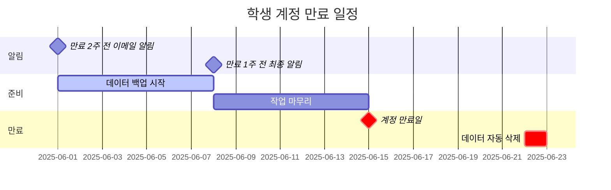

# 계정 만료 안내 (Account Expiration)

학생 계정은 프로젝트 기간이 정해져 있어 만료일이 있습니다. 이 가이드는 계정 만료 전 데이터를 안전하게 백업하고 원활하게 오프보딩하는 방법을 안내합니다.

## 만료 일정 이해

### 계정 만료 타임라인



### 중요 날짜

-   **만료 2주 전**: 첫 이메일 알림 발송
-   **만료 1주 전**: 최종 알림 발송
-   **만료일**: 계정 로그인 비활성화
-   **만료 7일 후**: 홈 디렉토리 자동 삭제 (백업 불가!)

!!! danger "데이터 삭제 경고"
    만료일로부터 7일 후에는 모든 데이터가 영구적으로 삭제됩니다. 반드시 만료일 전에 백업을 완료하세요!

## 만료 알림 확인

### 이메일 알림

계정 생성 시 등록한 이메일로 알림이 발송됩니다:

**제목**: `[SBEE Lab] Student Account Expiration Notice - 2 Weeks`

**내용**:
```
Dear [Your Name],

Your student account on SBEE Lab infrastructure will expire on 2025-06-15.

Account Information:
- Username: student_hong
- Servers: RHO, TAU
- Expiration Date: 2025-06-15
- Days Remaining: 14

Action Required:
1. Backup all important data before expiration
2. Request extension if needed
3. Clean up temporary files

Important: All data will be permanently deleted 7 days after expiration.

For assistance, contact operators or create a GitHub issue.
```

### 만료일 확인

서버에서 직접 확인:

```bash
# 계정 정보 확인 (운영자가 제공하는 명령어)
check-expiration

# 출력 예시:
# Account: student_hong
# Type: student
# Expiration: 2025-06-15
# Days remaining: 14
# Status: Active
```

## 데이터 백업 절차

### 1단계: 백업 대상 확인

백업이 필요한 데이터 목록 작성:

```bash
# 홈 디렉토리 구조 확인
tree -L 2 ~

# 중요 파일 크기 확인
du -sh ~/*

# 백업 목록 작성
cat > ~/backup-checklist.txt << 'EOF'
# 백업 체크리스트
[ ] ~/project/scripts/          (분석 스크립트)
[ ] ~/project/results/          (최종 결과)
[ ] ~/project/notebooks/        (Jupyter 노트북)
[ ] ~/project/README.md         (프로젝트 문서)
[ ] ~/.bashrc                   (환경 설정)
[ ] ~/.ssh/config               (SSH 설정)
[ ] ~/notes/                    (개인 노트)
EOF
```

### 2단계: 로컬 백업 (권장)

가장 안전한 방법은 본인 로컬 머신으로 백업:

```bash
# 로컬 머신에서 실행 (macOS/Linux)
# 전체 홈 디렉토리 백업
rsync -avz --progress student_hong@rho.sbee.lab:~/ ~/sbee-backup/

# 특정 디렉토리만 백업
rsync -avz --progress student_hong@rho.sbee.lab:~/project ~/sbee-backup/

# 압축하여 백업 (공간 절약)
ssh rho.sbee.lab 'tar -czf - ~/project' > project-backup-$(date +%Y%m%d).tar.gz
```

**Windows 사용자** (PowerShell):

```powershell
# WinSCP 또는 rsync for Windows 사용
# 또는 SFTP 클라이언트 (FileZilla 등)

# PowerShell에서 SCP 사용
scp -r student_hong@rho.sbee.lab:~/project C:\backups\
```

### 3단계: 백업 검증

백업이 제대로 되었는지 확인:

```bash
# 로컬에서 백업 파일 확인
ls -lh ~/sbee-backup/

# 압축 파일 무결성 확인
tar -tzf project-backup-20250601.tar.gz | head

# 파일 개수 비교
# 원격:
ssh rho "find ~/project -type f | wc -l"

# 로컬:
find ~/sbee-backup/project -type f | wc -l
```

### 4단계: 대안 백업 (보조)

로컬 백업 외에 추가 백업:

**GitHub/GitLab**:

```bash
# Git 저장소로 관리 중이면 푸시
cd ~/project
git add .
git commit -m "Final backup before account expiration"
git push origin main

# 대용량 파일은 Git LFS 사용
git lfs track "*.bam"
git add .gitattributes
git commit -m "Track large files with LFS"
git push
```

**클라우드 스토리지**:

```bash
# Google Drive (rclone 사용)
rclone copy ~/project gdrive:sbee-backup/

# OneDrive
rclone copy ~/project onedrive:sbee-backup/

# Dropbox
rclone copy ~/project dropbox:sbee-backup/
```

## 계정 연장 요청

프로젝트가 계속되어 계정 연장이 필요한 경우:

### 연장 자격 요건

-   현재 프로젝트가 진행 중
-   명확한 연장 사유
-   지도교수/PI의 승인

### 연장 요청 절차

1. **GitHub 이슈 생성**:

```markdown
Title: [Account Extension Request] 홍길동

## 기본 정보
- Username: student_hong
- Current Expiration: 2025-06-15
- Requested Extension: 3 months (2025-09-15)

## 연장 사유
프로젝트가 예상보다 길어져 추가 분석이 필요합니다.
- 현재 진행 상황: RNA-seq 분석 80% 완료
- 남은 작업: Differential expression analysis, 결과 검증
- 예상 완료일: 2025-09-01

## 지도교수 승인
- Name: Dr. Kim
- Email: kim@university.edu
- Approval: Yes (confirmed via email)

## 추가 사항
연장 기간 동안 주당 10-15시간 작업 예정
```

2. **Label 추가**: `account-extension`

3. **승인 대기**: 1-2 영업일 내 검토

!!! tip "연장 신청 타이밍"
    만료 1개월 전에 연장을 신청하는 것이 좋습니다. 만료일 직전 신청은 처리가 지연될 수 있습니다.

## 작업 마무리

### 실행 중인 작업 정리

```bash
# 모든 실행 중인 프로세스 확인
ps aux | grep $USER

# tmux 세션 확인
tmux ls

# 백그라운드 작업 확인
jobs

# 작업 중단 또는 완료 대기
# 중요한 작업은 완료될 때까지 대기
# 불필요한 작업은 중단
kill %1
tmux kill-session -t old-work
```

### 임시 파일 정리

```bash
# 스크래치 디렉토리 정리
rm -rf ~/scratch/*

# 로그 파일 정리
find ~ -name "*.log" -delete

# 캐시 삭제
rm -rf ~/.cache/*

# 다운로드한 압축 파일 삭제
find ~/data -name "*.tar.gz" -delete
find ~/data -name "*.zip" -delete
```

### 공유 디렉토리 정리

본인이 공유 디렉토리에 저장한 파일 확인 및 정리:

```bash
# 공유 디렉토리에서 본인 파일 찾기
find /nfs/shared -user $USER

# 불필요한 파일 삭제 또는 이동
# 유용한 파일은 적절한 위치로 이동
# 임시 파일은 삭제
```

## 최종 체크리스트

만료일 전에 다음 항목을 모두 확인하세요:

### 데이터 백업

- [ ] 모든 중요 파일을 로컬로 백업
- [ ] 백업 파일 무결성 검증
- [ ] 보조 백업 완료 (GitHub/클라우드)
- [ ] 백업 파일 접근 가능 확인

### 작업 정리

- [ ] 모든 실행 중인 작업 완료 또는 중단
- [ ] tmux 세션 종료
- [ ] 백그라운드 프로세스 정리

### 환경 정리

- [ ] 스크래치 디렉토리 정리
- [ ] 임시 파일 삭제
- [ ] 공유 디렉토리 정리
- [ ] 로그 파일 삭제

### 문서화

- [ ] 프로젝트 README 작성
- [ ] 분석 과정 문서화
- [ ] 재현 스크립트 정리
- [ ] 환경 설정 기록 (requirements.txt 등)

### 연장 (필요 시)

- [ ] 연장 요청 이슈 생성
- [ ] 지도교수 승인 확인
- [ ] 운영자 승인 대기

## 만료 후

### 계정 비활성화

만료일이 되면:

-   **SSH 접속 차단**: 로그인 불가
-   **데이터 보존**: 7일간 읽기 전용 보존
-   **복구 요청**: 긴급한 경우 운영자에게 연락

### 데이터 삭제

만료 7일 후:

-   **영구 삭제**: 모든 홈 디렉토리 데이터 삭제
-   **복구 불가**: 백업이 없으면 영구 손실

### 재신청

나중에 다시 계정이 필요한 경우:

```markdown
Title: [Account Request] 홍길동 (재신청)

## 기본 정보
- Previous Username: student_hong (expired 2025-06-15)
- 이전 프로젝트: RNA-seq 분석
- 새 프로젝트: Single-cell RNA-seq 분석

## 신규 프로젝트 정보
- 지도교수: Dr. Kim
- 기간: 2025-09-01 ~ 2025-12-31
- 목적: 석사 논문 연구

...
```

## 자주 묻는 질문

### Q: 만료일을 놓쳤는데 데이터를 백업할 수 있나요?

**A**: 만료 후 7일 이내라면 운영자에게 긴급 연락하여 임시 읽기 전용 접근을 요청할 수 있습니다. 하지만 보장되지 않으므로 반드시 만료 전에 백업하세요.

### Q: 연장은 몇 번까지 가능한가요?

**A**: 프로젝트가 진행 중이고 정당한 사유가 있으면 여러 번 연장 가능합니다. 하지만 각 연장마다 지도교수 승인이 필요합니다.

### Q: 백업 용량이 너무 큰데 어떻게 하나요?

**A**:
1. 재다운로드 가능한 원본 데이터는 제외
2. 중간 결과물은 최종 결과만 백업
3. 압축하여 백업
4. 클라우드 스토리지 활용

### Q: 계정 만료 후에도 연구실 멤버로 남아있나요?

**A**: 계정 만료는 시스템 접근만 제한합니다. GitHub organization 멤버십, 연구실 커뮤니케이션 채널은 유지될 수 있습니다 (PI 결정).

### Q: 만료 전에 모든 데이터를 삭제하면 안 되나요?

**A**: 본인이 직접 삭제할 필요는 없습니다. 만료 후 시스템이 자동으로 정리합니다. 백업만 잘 해두시면 됩니다.

## 도움 요청

계정 만료와 관련하여 문제가 있으면:

-   **긴급**: 운영자에게 직접 이메일
-   **일반**: GitHub 이슈 생성
-   **연장**: 계정 연장 이슈 템플릿 사용

## 감사 인사

SBEE Lab 인프라를 사용해 주셔서 감사합니다. 학습과 연구에 도움이 되었기를 바랍니다.

향후 다시 연구실과 함께하게 되면 언제든 환영합니다!
